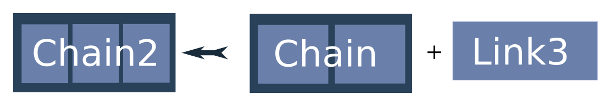
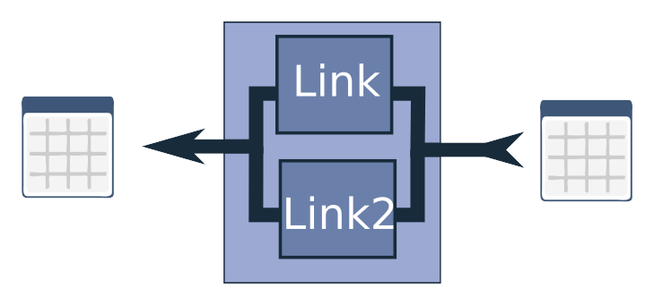
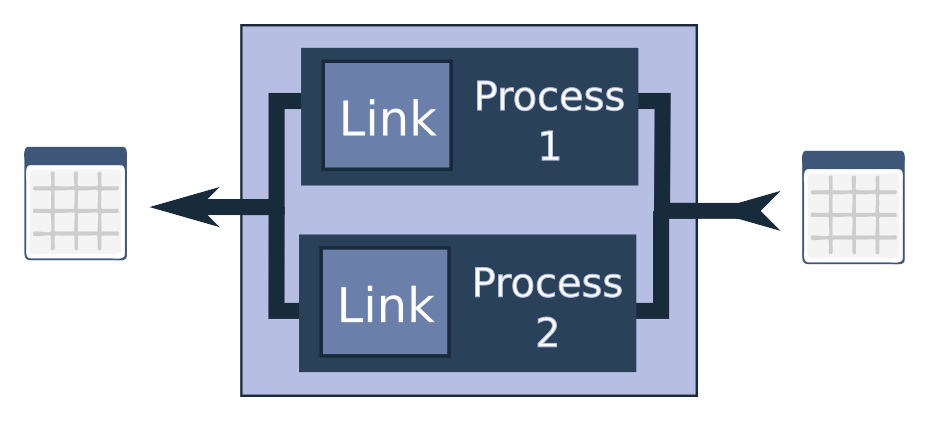
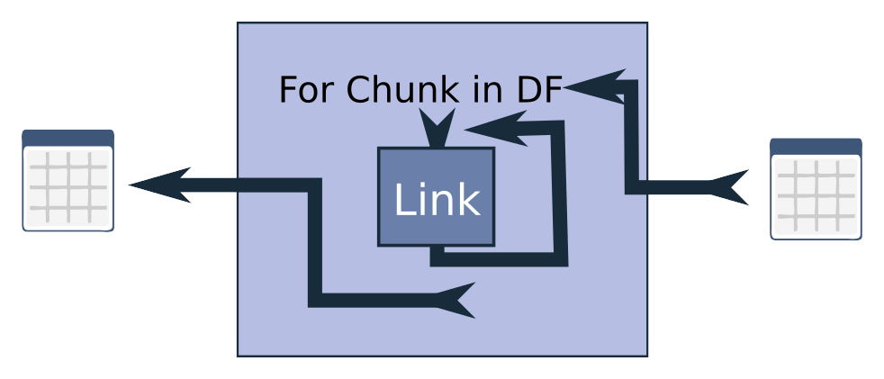

# pdChemChain Introduction

## What is pdChemChain?

pdChemChain is a framework for chainable pandas DataFrame manipulations, primarily focused on chemical processing via RDKit. It is designed for interactive use in notebooks — short code-test cycles, exploratory data analysis, and stepwise pipeline building — while also supporting deployment via config files and command-line execution.

The framework is built around three core API principles:

1. **Pandas In, Pandas Out** — every link takes a DataFrame and returns a DataFrame
2. **A Chain is Also a Link** — links compose with `+` into chains, which are themselves links
3. **Self-Configuring** — all links serialize to dictionaries, YAML, or JSON for reuse

Each is explained below.

## 1. Pandas In, Pandas Out

Every link takes a DataFrame and returns a DataFrame.

<p align="center"></p>

```python
from pdchemchain.links import MolFromSmiles
import pandas as pd

df = pd.DataFrame({"Smiles": ["c1ccccc1", "CCO", "CC(=O)O"]})
link = MolFromSmiles()
df_out = link(df)
```

Links are instantiated with parameters, then called like functions. The output is always a DataFrame, ready for the next step.

## 2. A Chain is Also a Link

Adding links together creates a Chain — and a Chain is itself a Link.

<p align="center"></p>

```python
chain = link1 + link2
```

<p align="center"></p>

A Chain behaves exactly like a single Link: `df_out = chain(df_in)`. Chains can be extended further:

<p align="center"></p>

```python
chain = link1 + link2 + link3          # addition
chain = sum([link1, link2, link3])      # from a list
chain = Chain(links=[link1, link2])     # explicit constructor
chain = chain + link3                   # extend an existing chain
```

## Compound Links

Compound links control how data flows through the pipeline.

### UnionLink

Runs the DataFrame through two parallel paths and merges the results. Values from the left path take precedence on overlapping columns.

<p align="center"></p>

The recommended syntax uses the `|` operator, which mirrors how `+` builds a `Chain`:

```python
union = path_a | path_b
df_out = union(df)
```

It composes naturally into larger pipelines:

```python
pipeline = link1 + link2 + (link3 | link4) + link5
```

**Operator precedence — use parentheses for clarity**

In Python, `+` binds more tightly than `|`, just like multiplication before addition in arithmetic. This means:

```python
link1 + link2 | link3 + link4
# is actually: (link1 + link2) | (link3 + link4)
# NOT:        ((link1 + link2) | link3) + link4  ← naive left-to-right reading
```

The precedence works in your favour here, but a reader unfamiliar with it may be surprised. Always use parentheses to make the structure explicit:

```python
# Recommended — intent is unambiguous:
pipeline = prep + filter + (score_transform | passthrough) + output

# Avoid — correct but confusing:
pipeline = prep + filter + score_transform | passthrough + output
```

For example, running an expensive calculation only on molecules that pass a filter, while keeping the rest unchanged:

```python
from pdchemchain.links import Query, NullLink

# Only run expensive docking on molecules that pass a QSAR filter
pipeline = qsar + (
    Query(query="QsarScore > 0.5") + expensive_docking_chain
    | Query(query="QsarScore <= 0.5")   # these rows pass through unchanged
)
```

Another common pattern is filtering out unwanted rows while saving them for later inspection:

```python
from pdchemchain.links import Query, ToFile, DropTable

union = (
    Query(query="QsarScore > 0.5")                                              # keep good rows
    | Query(query="QsarScore <= 0.5") + ToFile("rejected.csv") + DropTable()   # save and discard
)
```

You can also construct `UnionLink` explicitly, which is useful when building pipelines programmatically:

```python
from pdchemchain import UnionLink

union = UnionLink(link1=path_a, link2=path_b)
```

### Partitioned Processing

For large datasets, partition processors split the DataFrame into chunks:

**Parallel** — multiprocessing across CPU cores:

<p align="center"></p>

**Serial** — process one chunk at a time to save memory:

<p align="center"></p>

The recommended syntax uses fluent methods directly on any link or chain:

```python
# Parallel: defaults to physical core count, 2x partitions for better load balancing
parallel = my_chain.parallel()          # auto workers
parallel = my_chain.parallel(workers=4) # explicit

# Serial: chunks of fixed size
serial = my_chain.chunked(1000)
```

These compose naturally in pipelines:

```python
pipeline = prep_chain.parallel(4) + filter + scoring.chunked(500)
```

You can also construct the processors explicitly, which is useful for full control over partitioning:

```python
from pdchemchain.links import ParallelPartitionProcessor, SerialPartitionProcessor

parallel = ParallelPartitionProcessor(link=my_chain, num_processes=4, num_partitions=8)
serial = SerialPartitionProcessor(link=my_chain, partition_size=1000)
```

## 3. Self-Configuring

All links are self-documenting and auto-configurable. Every link can be serialized to a dictionary and recreated from it:

```python
params = chain.get_params()        # dict with all settings
clone = Link.from_params(params)   # recreate the chain
```

This extends to saving and loading from YAML/JSON:

```python
chain.to_config_file("pipeline.yaml")
loaded = Link.from_config_file("pipeline.yaml")
```

Saved pipelines can be run from the command line:

```bash
pdchemchain run pipeline.yaml --in_file input.csv --out_file output.csv
```

See the [CLI Reference](CLI.md) for full details.

## Error Handling

Exceptions in row-wise links are caught and stored in a special `__error__` column rather than crashing the pipeline. Error rows can be filtered out with `StripErrors`:

```python
from pdchemchain.links import MolFromSmiles, StripErrors
import pandas as pd

df = pd.DataFrame({"Smiles": ["C", "Nope!"]})
chain = MolFromSmiles() + StripErrors()
df_out = chain(df)
# df_out contains only the valid row
```

## Discovering Available Links

The toolbox gives an interactive overview of all available link classes:

```python
from pdchemchain import toolbox
toolbox
```

This displays a table with each link's module, tooltip, and constructor signature — useful for exploring what's available without leaving the notebook.

## Creating Custom Links

New links require minimal code. Use `@dataclass` and inherit from `RowLink`:

```python
from dataclasses import dataclass
from pdchemchain.base import RowLink
from pdchemchain.typing import InColumnName
from rdkit.Chem import Descriptors
import pandas as pd

@dataclass
class HeavyAtomCount(RowLink):
    in_column: InColumnName = "ROMol"
    out_column: str = "HeavyAtomCount"

    def _row_apply(self, row: pd.Series) -> pd.Series:
        mol = row[self.in_column]
        row[self.out_column] = Descriptors.HeavyAtomCount(mol)
        return row
```

The `RowLink` base class provides automatic error handling, serialization, and input column validation. See [CONTRIBUTION.md](../CONTRIBUTION.md) for detailed guidelines.

## Design Trade-offs

**Strengths:**
- Fast interactive building in notebooks with immediate feedback
- Pipelines built interactively can be saved and reused from the command line
- Minimal code to create new link classes
- Row-wise error handling out of the box

**Limitations:**
- Single DataFrame in, single DataFrame out — a pipeline can't produce multiple output streams (use `UnionLink` + `ToFile` as a workaround)
- In-memory processing — very large datasets may need `SerialPartitionProcessor` or column pruning
- Row-wise links don't see the full dataset — cross-row operations (aggregation, grouping) need the `Link` base class
- Column names starting and ending with `__` are reserved for internal use

## Next Steps

- **[CLI Reference](CLI.md)** — command-line usage, SDF/CSV handling, advanced options
- **[REINVENT Integration](reinvent/README.md)** — use pdchemchain pipelines as scoring components in REINVENT reinforcement learning
- **Example Notebooks:**
  - [Lipinski Filter](notebooks/Lipinski_filter_example.py) — stepwise interactive pipeline that filters a dataset by the Rule of Five
  - [Contribution Examples](notebooks/contribution_examples.py) — examples of creating custom Link and RowLink subclasses
  - [Partitioning Safety](notebooks/partitioning_safety.py) — how partitioning interacts with row-wise vs dataframe-wide operations
- **[Contribution Guide](../CONTRIBUTION.md)** — how to create and contribute new links
